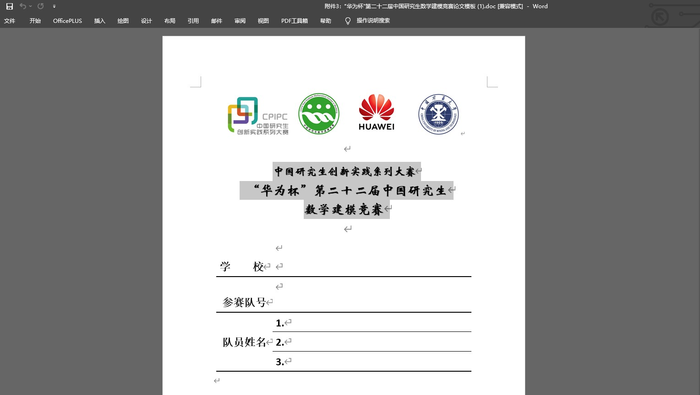
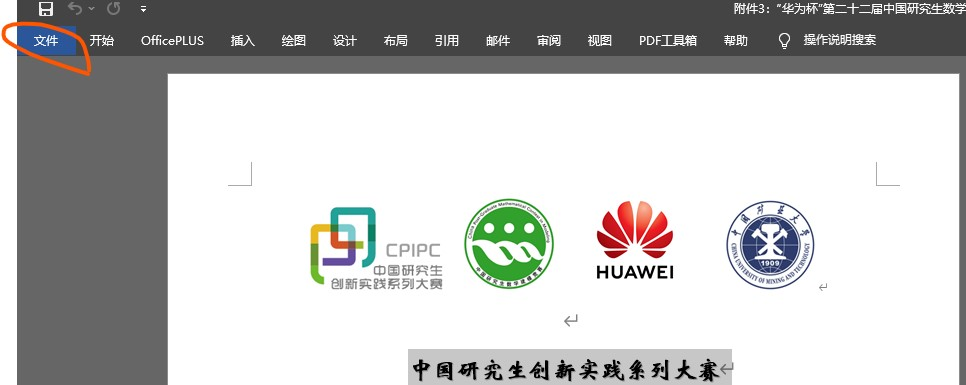
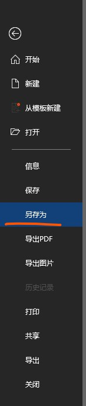
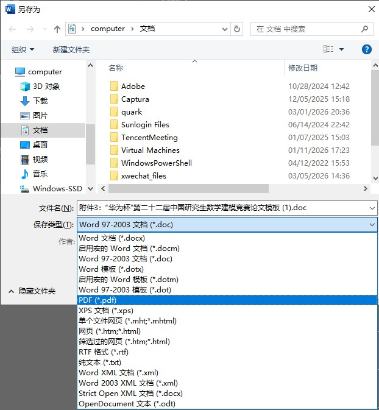
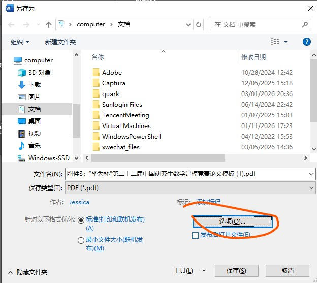
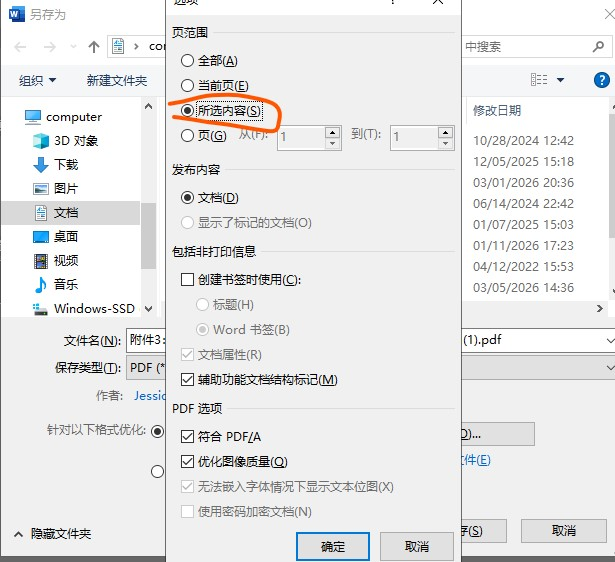
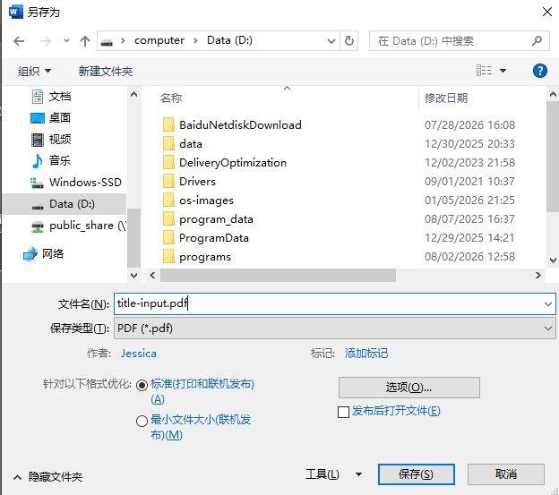
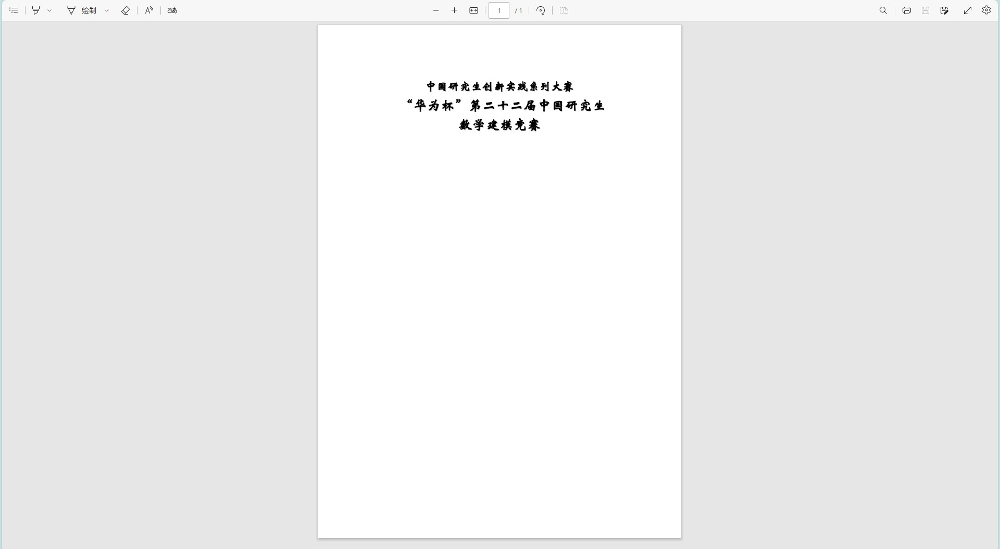
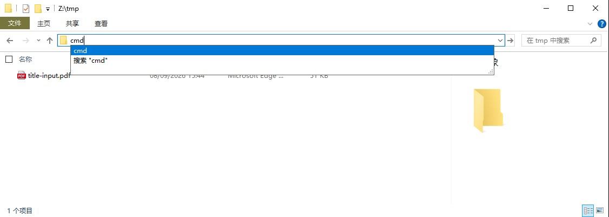
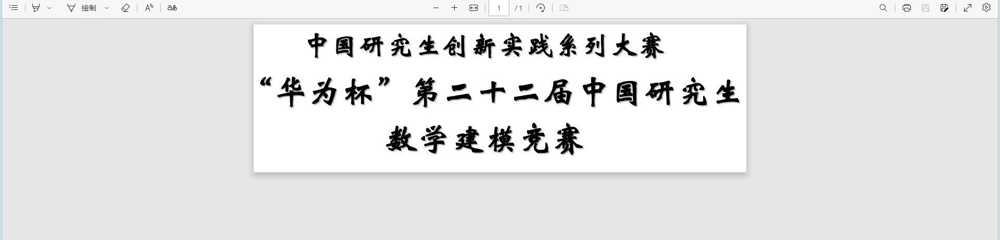

<!-- vim-markdown-toc GFM -->

* [NPGMCM](#npgmcm)
	* [文件列表](#文件列表)
	* [下载方式](#下载方式)
		* [方法1-git克隆](#方法1-git克隆)
		* [方法2-直接下载某版本的源码压缩包](#方法2-直接下载某版本的源码压缩包)
	* [编译](#编译)
		* [本地编译](#本地编译)
			* [方法1-用 xelatex 编译](#方法1-用-xelatex-编译)
			* [方法2-用 latexmk 编译](#方法2-用-latexmk-编译)
		* [在线编译](#在线编译)
	* [文档类选项说明](#文档类选项说明)
	* [封面图标和竞赛名称图片更换说明](#封面图标和竞赛名称图片更换说明)

<!-- vim-markdown-toc -->

# NPGMCM

- LaTeX Template for National Post-Graduate Mathematical Contest in Modeling
- 全国研究生数学建模竞赛 LaTeX 模板
- 项目地址: [npgmcm](https://github.com/jayxin/npgmcm)
- 本项目在[andy123t](https://github.com/andy123t)的[GMCMthesis](https://github.com/andy123t/GMCMthesis)项目基础上修改和添加内容，并调整项目结构，使整个项目结构更清晰，方便使用和维护。在此感谢原作者[latexstudio](https://github.com/latexstudio)和[andy123t](https://github.com/andy123t)的贡献！

## 文件列表

```none
.
├── commons/ 模板
│   ├── fonts/ 不同操作系统下的字体方案定义
│   │   ├── npgmcm-font-fandol.def linux 系统
│   │   ├── npgmcm-font-mac.def Mac OS 系统
│   │   └── npgmcm-font-windows.def Windows 系统
│   ├── npgmcm.bst 参考文献渲染样式定义
│   ├── npgmcmthesis.cls 基础模板
│   └── preamble.tex 用户自定义添加宏包、命令等
├── contents/ 内容
│   ├── abstract.tex 摘要
│   ├── appendix/ 附录
│   ├── info.tex 论文基本信息
│   ├── references.bib 参考文献数据库
│   ├── references.tex 参考文献
│   └── sections/ 正文内容
├── docs/ 论文格式说明和模板等文档
│   ├── 第二十二届中国研究生数学建模竞赛论文格式规范.pdf
│   └── 第二十二届中国研究生数学建模竞赛论文模板.doc
├── imgs/ 存放 README.md 引用的图片文件
├── figures/ 存放论文用到的图片文件
│   ├── logo.pdf 封面的 logo
│   └── title.pdf 竞赛名称
├── fonts/ 存放字体文件, 保持原位, 无需安装
│   ├── kai.ttf 楷体
│   ├── lishu.ttf 隶书
│   └── source-series/ 思源系列字体
│       ├── SourceHanSansCN-Regular.ttf 黑体
│       ├── SourceHanSerifCN-Regular.ttf 宋体
│       └── SourceHanSerifCN-SemiBold.ttf 宋体-加粗
├── .gitignore git 版本控制忽略文件
├── latexmkrc latexmk 配置文件
├── LICENSE.txt 使用许可
├── main.tex **主文档(Main document, 编译入口文件)**
└── README.md 项目说明
```

## 下载方式

### 方法1-git克隆

需要已经安装好 `git`。

```sh
git clone https://github.com/jayxin/npgmcm
```

网络不好可用中转克隆:

```sh
git clone https://gh-proxy.org/https://github.com/jayxin/npgmcm
```

### 方法2-直接下载某版本的源码压缩包

- 下载地址:<br>
https://github.com/jayxin/npgmcm/archive/refs/tags/v1.0.0.zip
- 中转下载地址:<br>
https://gh-proxy.org/https://github.com/jayxin/npgmcm/archive/refs/tags/v1.0.0.zip

最新版本可到 Tags 页面(https://github.com/jayxin/npgmcm/tags) 查看，将下载地址的版本编号替换成最新的再下载即可。

Releases 页面(https://github.com/jayxin/npgmcm/releases) 可下载到各版本预览的 PDF，带有 `-color` 后缀的是彩色文档(如表格等)排版的示例。

## 编译

### 本地编译

- 使用前提: 本地已装好 LaTeX 的发行版如 TeXLive
- 已测试环境:
	+ 操作系统 - Linux
	+ LaTeX 发行版 - TeXLive 2023

#### 方法1-用 xelatex 编译

需手动编译多次，引用等内容才能正确显示。

```sh
xelatex main
bibtex main
xelatex main
xelatex main
```

#### 方法2-用 latexmk 编译

自动编译多次:

```sh
latexmk main
```

清理辅助文件(`log`、`aux`等):

```sh
latexmk -c main
```

清理辅助文件(`log`、`aux`等)和 `pdf`:

```sh
latexmk -C main
```

### 在线编译

- 可使用在线的编译平台进行编译如:
	+ [TeXPage](https://texpage.com)
	+ [OverLeaf](https://overleaf.com)
- 已测试平台: TeXPage, 进行编译前需保证如下设置
	+ 编译器: `xelatex`
	+ TeXLive 版本: 2023
	+ 主文档(Main Document): main.tex

## 文档类选项说明

本项目文档类(Document Class)目前支持下面的选项:
- `draft`: 是否嵌入图片和代码, 默认嵌入。此选项目的是为了在LaTeX编辑过程中提高编译速度, 最终文档请勿包含此选项！
- 打印选项:
	* `bwprint`: 黑白打印。
	* `colorprint`: 彩色打印(默认)。
- `withoutpreface`: 最终文档不含封面, 不加此选项则默认包含。
- 操作系统选项(影响文档使用的字体, 根据您的操作系统做相应的更改):
  * `linux`: 使用本项目 `fonts/` 目录下的字体和 LaTeX 发行版自带字体(默认)
  * `windows`: 使用 Windows 操作系统的字体
  * `mac`: 使用 Mac 操作系统的字体

示例:

```latex
\documentclass[windows,bwprint,withoutpreface]{commons/npgmcmthesis}
```

这个例子使用 Windows 操作系统的字体、黑白打印、不带封面。

## 封面图标和竞赛名称图片更换说明

封面 Logo:


封面竞赛名称:


封面图标和竞赛名称每一年都是不同的，所以需要根据当年的具体内容进行更换。这两个内容是以图片的形式嵌入文档的，分别对应 `figures/` 目录下的 `logo.pdf` 和 `title.pdf` 文件。

有2种可能的替换格式:
- 位图: 如 `.jpg`, `.png` 等格式，可从官方提供的论文模板中分别截图得到logo和名称的图片文件，比如最后保存的是 `jpg` 格式的图片，那么应该分别命名成 `logo.jpg` 和 `title.jpg` 然后放入项目 `figures/` 目录下，最后编译即可。
- 矢量图: `pdf` 格式，建议使用 `pdf` 格式，因为矢量图格式相对位图比较清晰，放大不会失真。

更换为矢量图的整体步骤如下:
1. 从官方渠道下载当年 Word 格式的论文模板。
2. 使用 Windows 的 Word 软件打开论文模板，分别选取logo和名称部分导出对应的pdf，这里导出的 pdf 应该是 A4 大小的，所以需要进一步裁剪 pdf 到合适的大小。
3. 使用 `pdfcrop` 命令(需要有 `TeXLive` 发行版)裁剪上个步骤导出的 2 个 pdf。
4. 确保裁剪后的 2 个 pdf 分别命名成 `logo.pdf` 和 `title.pdf`。
5. 将 2 个 pdf 放到项目的 `figures/` 目录下替换原来的 `logo.pdf` 和 `title.pdf`。

下面演示如何从 Word 导出竞赛名称的 pdf 以及将它裁剪到合适的大小，logo 的可效仿之。

1. 鼠标选中内容:



2. 选择 `文件`:



3. 选择 `另存为`:



选择磁盘上的一个位置(想要输出文件保存的地方)。

4. 选择 `pdf` 格式:



5. 选择 `选项`:



6. 选择 `所选内容`:



7. 命名为 `title-input.pdf` 并保存到对应位置:



8. `title-input.pdf` 应该是一个 A4 大小且只包含选中内容的 pdf 文档:



9. 文件资源管理器打开 `title-input.pdf` 所在目录, 清空地址栏, 输入 `cmd` 并回车，会看到命令行窗口:



10. 使用 `pdfcrop` 命令(假设你已经在本地安装好了 TeXLive)对 `title-input.pdf` 进行裁剪:

输入下面的命令(根据自身情况可能需要多次运行此命令来调整到合适大小):
```
pdfcrop --margins "-80 5 -5 -5" --clip title-input.pdf title.pdf
```

`margins` 后的 4 个数字表示额外添加的边距，边距大于 `0` 表示增加边距，边距小于 `0` 表示缩小边距。默认 4 个数字都是 `0`，即不加额外边距。方向从左到右分别是左、上、右、下。上面的命令表示左边距减少 `80` 个单位(bp)，上边距增加 `5` 个单位，右边距和下边距分别减少 `5` 个单位。具体数值请根据您的情况自行调整。

可以看到 `title.pdf` 被裁剪到了合适的大小。



11. 最后将 `title.pdf` 放到本项目 `figures/` 目录下即可。

<!-- vim: set noet: -->
